# grade.py & evaluate_grade_py_performance.sh
This function turned out to be more involved than initially anticipated. Development started this on 01/31 and tried multiple methods to get to the current implementation we have here. Below we have broken down the approaches initial ideated and implemented in older commits in this repo. We refactored this portion multiple times due to a desire for better performance. This took the entire project length to get working and we are thankful we started on this early as it was non-stop work to get this in a stable state. For brevity, we are omitting the descriptions of how some of these functions were implemented in approach 1 and 2 and leave that to the reader to explore the functions in the current repo. Additional code that actually uses the functions is given with the commit ID and message to the relevant areas to look.

 
 

## Approach 1: Corner matching on numbers - "Baseline"
 - This version can be seen in commit ID 8729d9b "Added initial sub-box detection for the actual spaces students fill in." on 02/05 of the pcoen_dev branch

The idea behind this approach was to perform corner detection on the entire sheet using a Harris corner detector and then find where numbers for each problem matched the manual labels we made in the blank form. This first was done by performing corner detection on the blank sheet using a modified Harris corner detector we made. We then search a defined grid-space around the origin of this number on the blank form (this is to avoid the shifting/translation issues when the sheets were scanned in). The grid-space we found worked best was around 40 pixels offset in all directions from the origin of the labeled box in the blank sheet. The second stage to this method was to look for the various filters in Figure 4 for each detected box (this can be seen in Figure 3).

Our average accuracy using this method was around 85% of boxes found within a given sheet. We did see some variance in the sheets that wasn't included in our commits. The best accuracy seen was around 95% in a-30 and the worst was 80% in a-27.

We attempted further parameter tuning, but found this method to be lacking the robustness needed to find the numbers to do alignment. One of the largest issues this method faced was with noise in the images as this directly impacted the ability to discern the numbers successfully. Another factor that led us to the other methods was that some numbers look similar in corner space and lead to issues that can be seen in Figure 2 that carries into Figure 3. We also tried matching numbers without using corners (and just using the manual labels like we have in Figure 1), but this ended up being drastically worse in both performance and accuracy.

 
 

  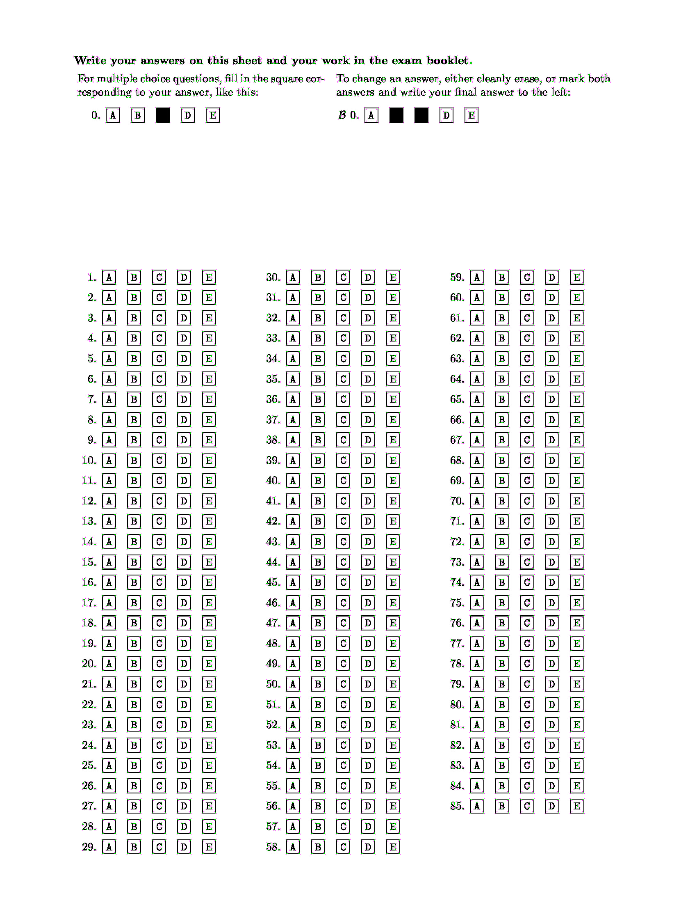
  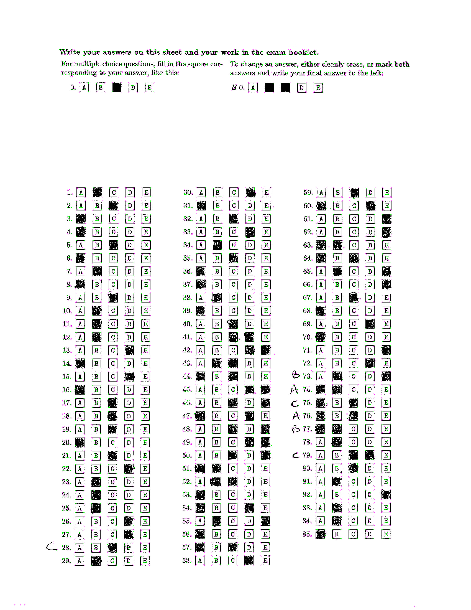

**Figure 1: Blank form (left) and form a-30 (right) with detected corners in pink (external detections) and green (colliding detections)**

 
 

  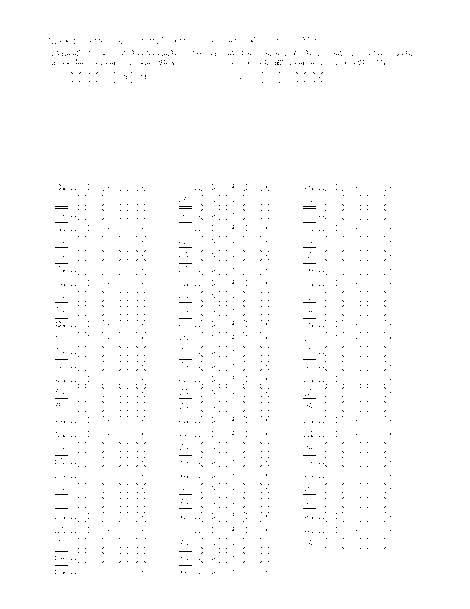
  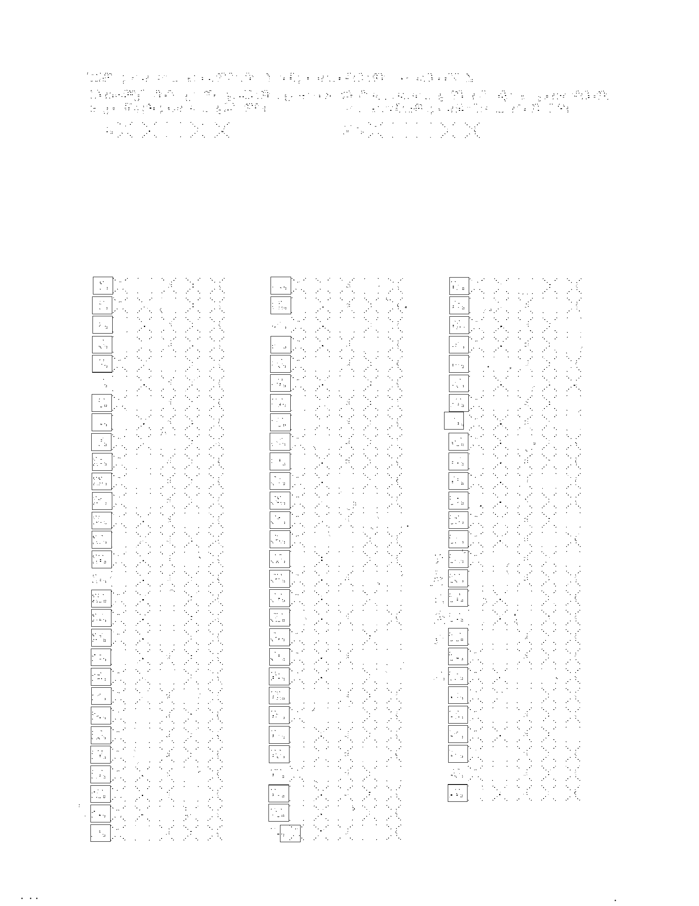

**Figure 2: Blank form (left) and form a-30 (right) with detected pink corners. The blank form on the left has manual labels annotated and form a-30 on the right has the detected numbers.**

 
 

  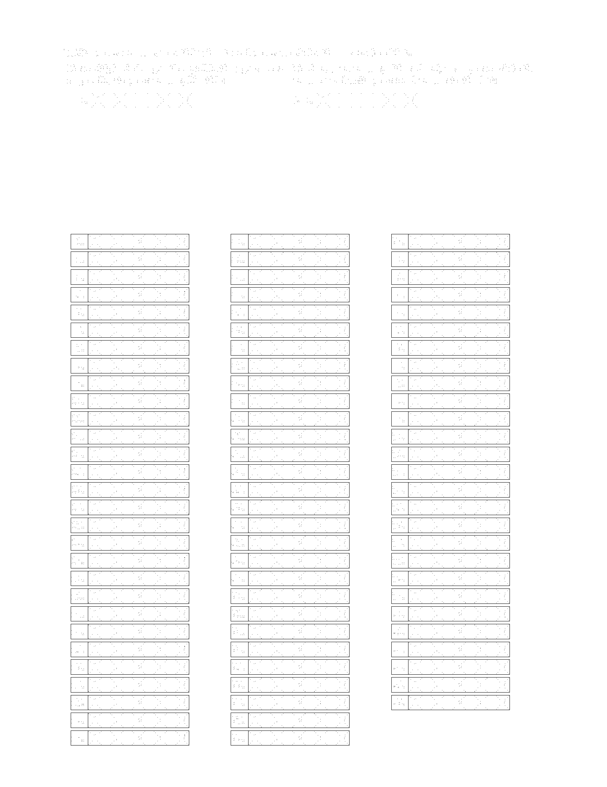
  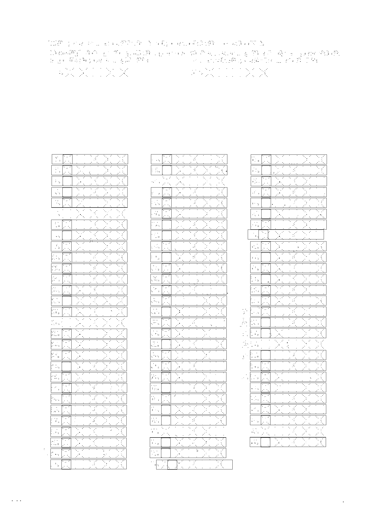

**Figure 3: Blank form (left) and form a-30 (right) with expanded boxes and the first sub-box found using filter mask X.**

 
 

  
  
  
  

  
  
  
  
  

**Figure 4: Mask filters used to match sub-boxes.**

**Top row (left to right): X "corners", X, thinned X, box.**

**Bottom row (left to right): A corners, B corners, C corners, D corners, E corners.**

**Best results were seen with X thinned.**

 
 

## Approach 2: Corner matching numbers v2 - "Chaos"
 - This version can be seen in commit ID 4627dcf "Update on how boxes were found." on 02/08 of the pcoen_dev branch:

This approach's design philosophy resolved around how number's corners are grouped together to get better computational performance. This idea takes the pixels found from the blank form's boxes in Figure 2 (left) and uses these as points. It then computes the distance from each point within this box to every other point in this box and stores this in a vector format. We then look in the same defined grid-space around the origin as described in Approach 1, but this time we compute the n-nearest pixels to the other pixels (where n is the total number of pixels on a per-box basis from the blank form ground-truth labels). The idea here is that we want to minimize the vector distance of each of the nearby points. By looking at the neighbor's distance and trying to minimize the error between these distance vectors, we can try to find a similarly matching "density" of pixels that should correspond to the actual numbers. The results from this can be seen in Figure 5 (left). Figure 5 (right) shows the most likely transform (the line given) and attempts to place a box using this information. Apologies on the box placement in Figure 5 (right) as this had a bug with the transform used and caused some boxes to end up in the opposite direction of the line given. Additionally, some vectors are not present and result in spurious boxes being placed in the image.

When we ideated this approach, we initially thought it would be a more robust way to do alignment as the density of corner pixels should be similar. With that being said, performance on this was lackluster at best and was hyper sensitive to the search-space around the origin we defined. Additionally, since the distance vectors were sorted, many pixel groups ended up matching the same pixel and we would have needed a way to disambiguate these matches. This caused us to refactor our entire approach to get something more robust to movement, pixel density, and noisy images. This refactor is described in Approach 3.

Since performance on this method was so poor and additional time would be needed for a refactor, we opted to not evaluate the dataset on this method as it performed worse in our initial testing compared to Approach 1.

 
 

  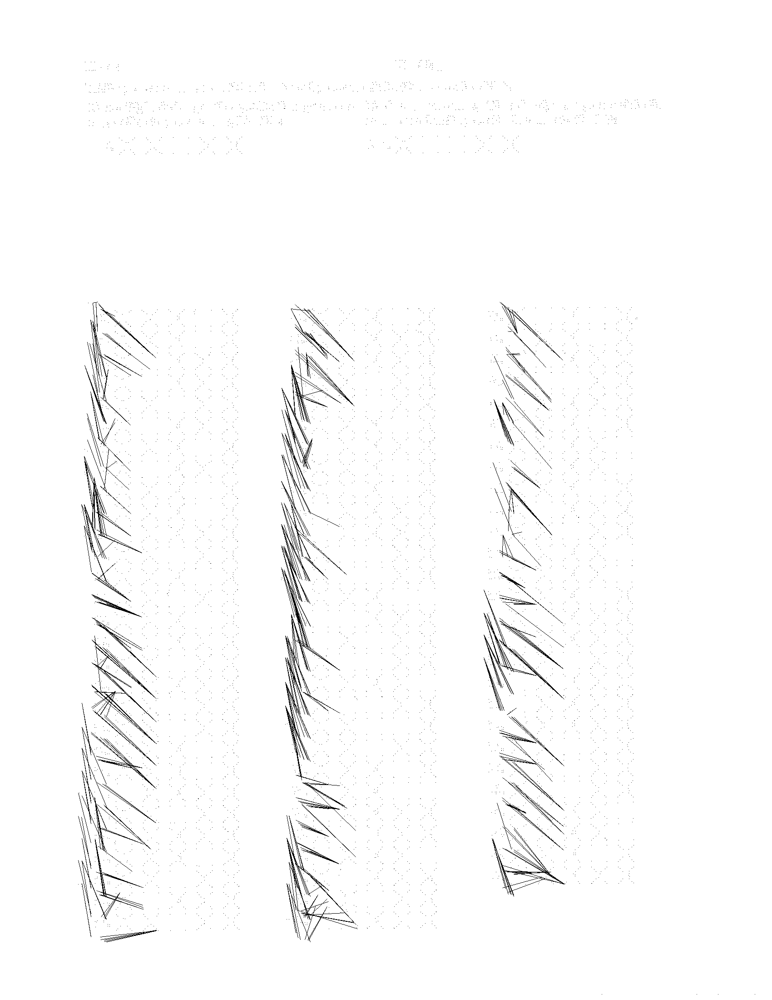
  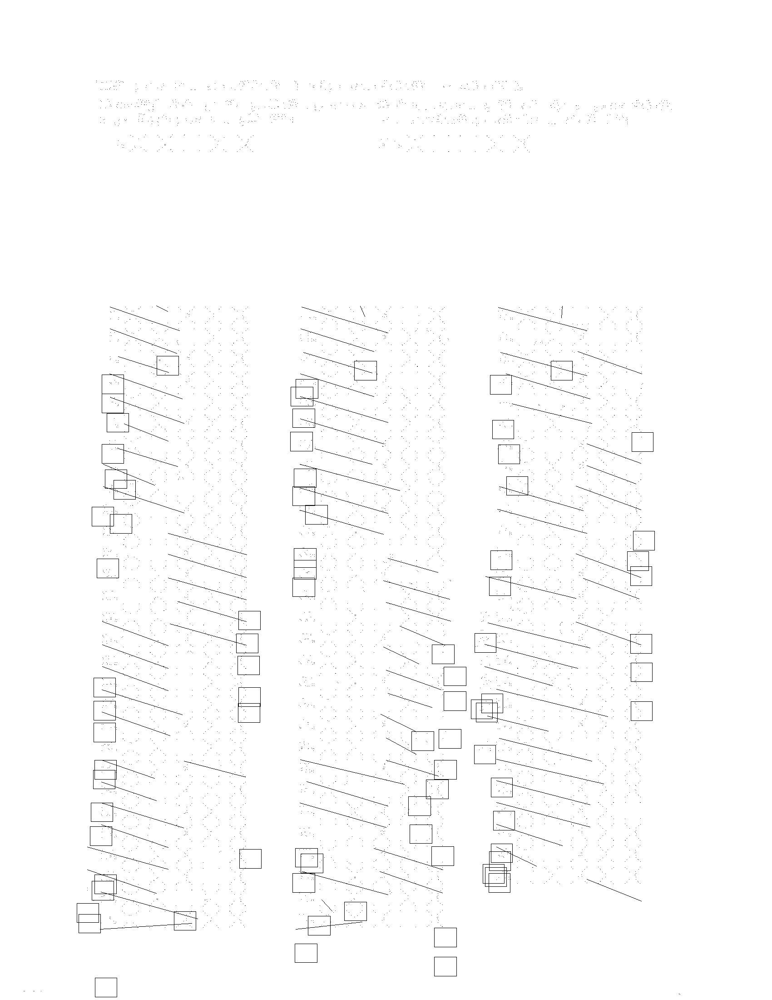

**Figure 5: Per-pixel cluster matches (left) and highest match approach (right)**

 
 

## Approach 3: Hough column detection and row parsing with thresholds - ""
 - This is the current version included in the repo and was completed on 02/14:

For this approach, we first apply sobel filters (with added dilatation and gaussian blur) to determine edges in the image. This can be seen in Figure 6. We then apply a mask onto the image to remove the top 500 pixels to avoid false-positive in the words at the top of the page. This is then passed along to a Hough line detection function we made. This function finds the k-top lines within an image for a subset of theta values by finding the peak line, removing values associated to the peak line, and re-running it to find the next peak line. It does this k-times to avoid similar line detections. Since we are only looking for rows/columns, we only looked for vertical and horizontal lines (0 and 90 degrees). Once we have the lines, we convert them back into x/y space and plot them on the image (Figure 7). We then filter out all horizontal lines as we found detecting these consistently to be difficult (Figure 8). We search between detected vertical lines for when they are the mainly white pixels that exist in near- complete vertical lines. These areas are greyed out to ignore them (Figure 9). For row detection, we take a histogram with bins as pixels along the vertical axis (essentially summing/collapsing rows together). We can then look at all columns simultaneously to find row gaps in the image. This can be seen in Figure 11 in addition to a defined threshold value we found to work well. The yellow lines in this figure represent row separations. To avoid spurious detections in the top of the image, we search for rows from the bottom of the image (largest vertical value) to the smallest and stop when we get the first 30 values. Once we have row separations, we can look at the mean value of each column in the same fashion using the same histogram method on a per-column basis. A different threshold is used here to detect when a box is filled in. The results for the first column in a-48 can be seen in Figure 10 where green "+" values represent detected filled-in boxes. This is then translated back into image space and plotted in Figure 12. We then take all the found boxes and search an offset amount from the first column in each group of 5 to detect letters based on (again) another pre-defined threshold we found to be good. This can be seen as the yellow/orange boxes in Figure 13.

Overall, this method was initially sensitive to threshold values, but with various amounts of normalization of values, we reduced this to be able to create a model with a high degree of accuracy. When testing with evaluate_grade_py_performance.sh, we found 0 errors in the test data even though parameters for thresholds were only found using a-27, a-30, and a-48. This indicates this approach will likely generalize to other unseen datasets. An additional advantage is the speed of computation. By using numpy (and vectorizing a lot of our computation), the time to run on one image is generally only around 10 seconds using silo.

This method isn't without it's draw-backs though! It is hypothetically susceptible to an attack by a student drawing a horizontal line on the bottom of the page (this would cause mis-alignment and result in most things being shifted by one row). Additionally, if a student is more careless in how they fill in boxes (similar to what can be seen in c-33 between 21 and 22 between box D), row alignment could also fail here. This would only cause results for one column to be incorrect though (and with a modification to this implementation could be robust enough to handle this).

Overall, I think we are happy with these results and think this will generalize well to the unseen test-set.

 
 

  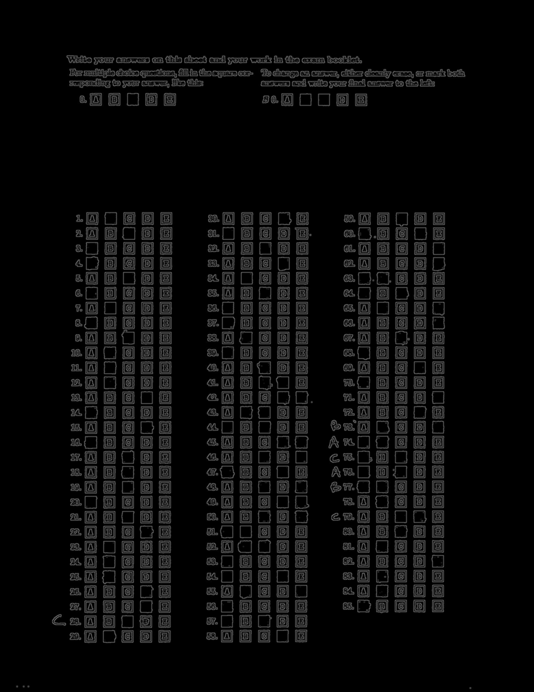

**Figure 6: Edge detection using sobel filters on a-30 form.**

 
 

  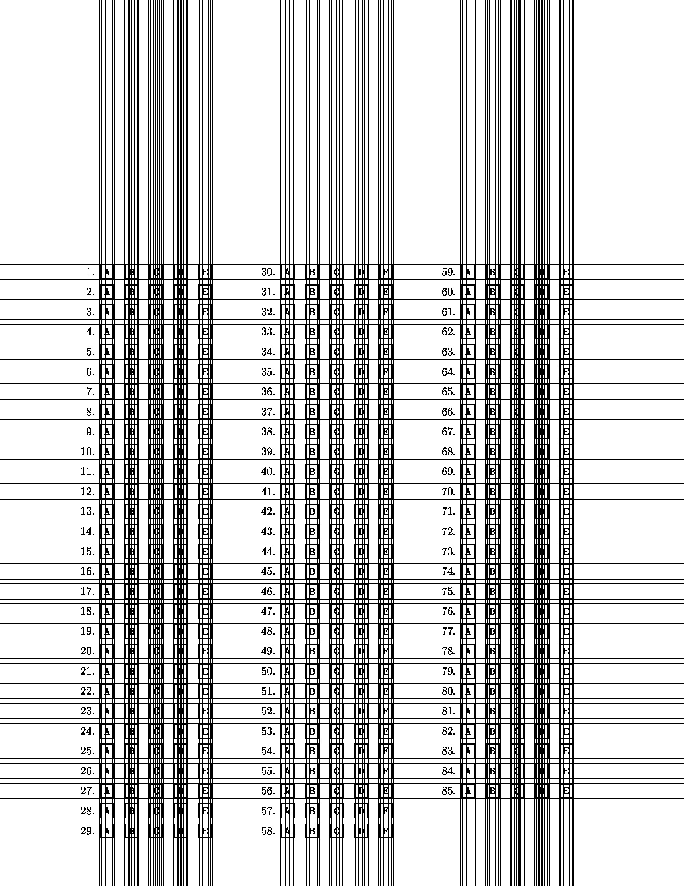
  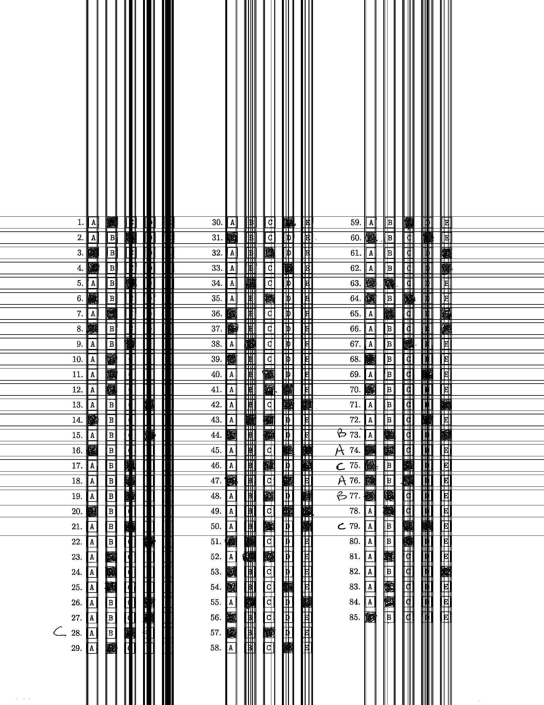

**Figure 7: All 120 detected Hough lines on blank form (left) and a-30 (right).**

 
 

  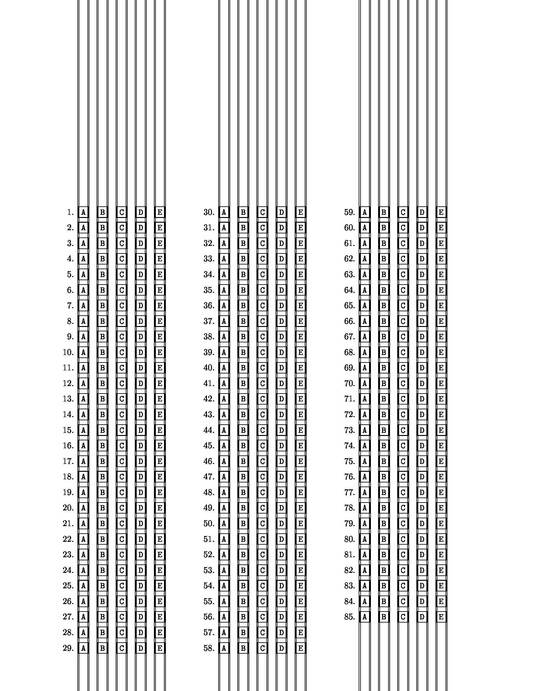
  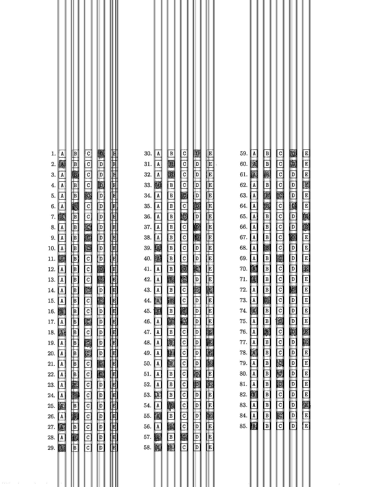

**Figure 8: Vertical line filter on detected Hough lines in blank form (left) and a-30 (right).**

 
 

  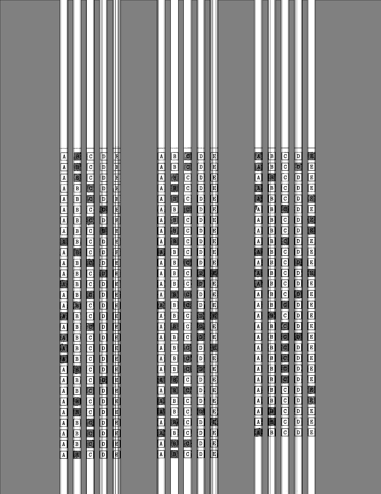
  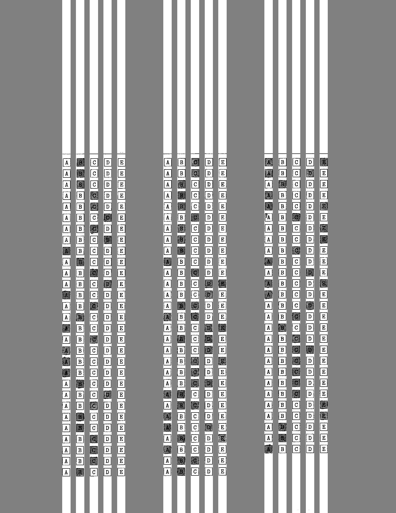

**Figure 9: Blank area applied gray filter on unfiltered lines (left) and the result of filtering out non-gray lines (right) on a-30's Hough lines.**

 
 

  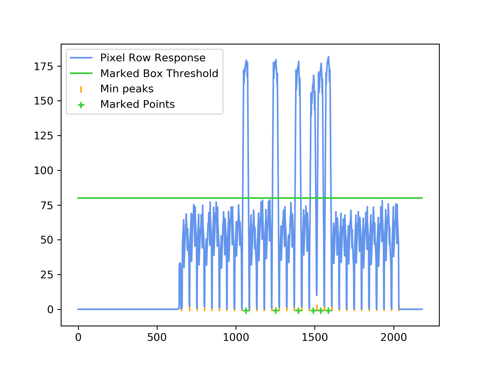

**Figure 10: First detected column of a-48 as a histogram along the height axis (width is summed together across the detected column). The vertical axis is the number of pixels detected and the horizontal axis is the pixel value along the height of the image. Yellow lines are described in Figure 11, green points are detected filled in boxes.**
 
 

  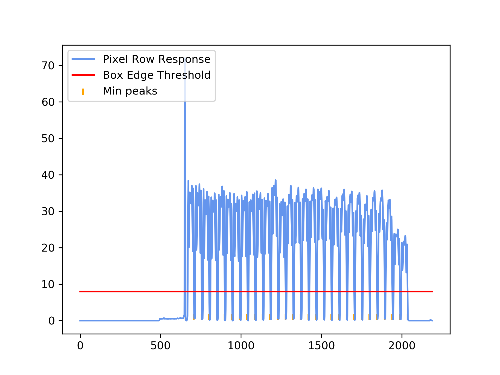

**Figure 11: Histogram across all columns with the same axis as described in Figure 10. The red line denotes where we detect the separations of row values.**

 
 

  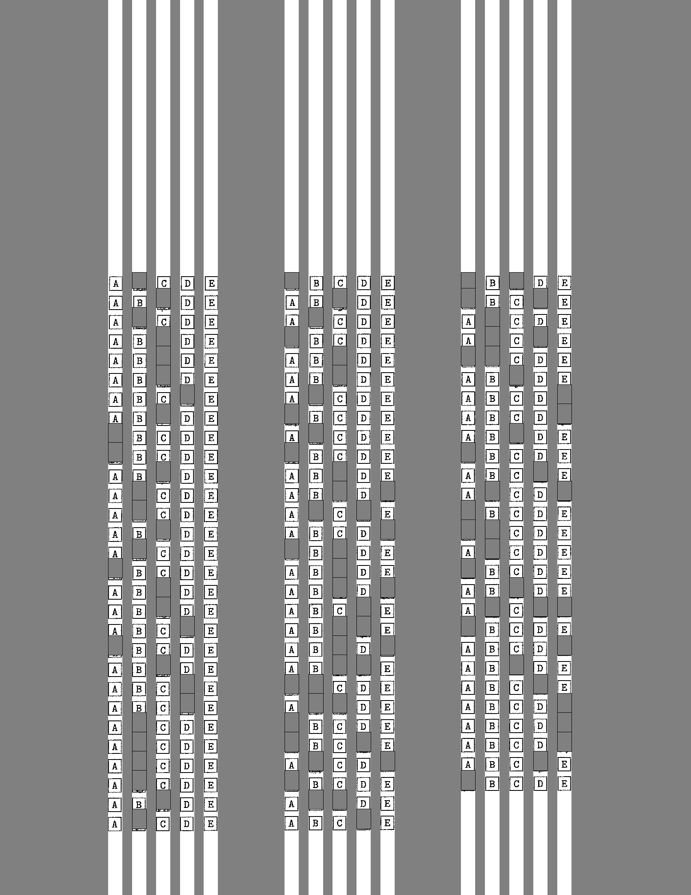

**Figure 12: Visualization of detected boxes from the histograms in Figure 10 and Figure 11.**

 
 

  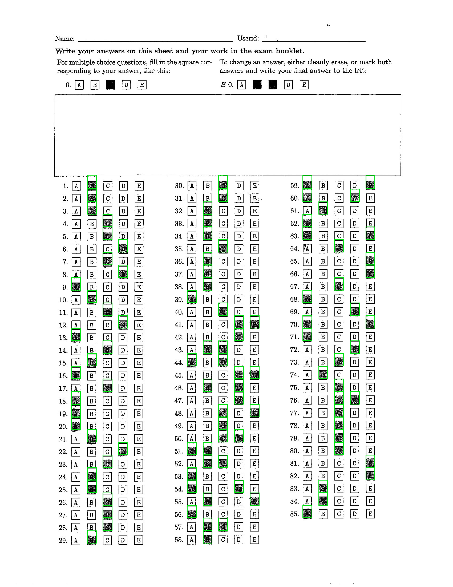
  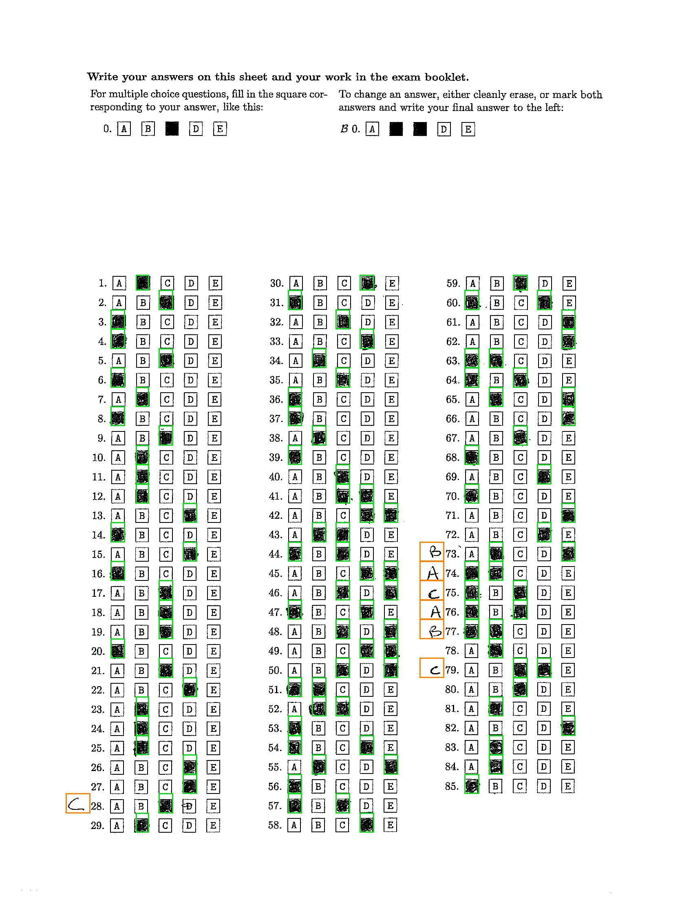

**Figure 13: Final output visualization of a-48 (left) and a-30 (right).**

 
 

And finally a memorable quote from Todd Howard:

 
 

# inject.py & extract.py

The following section of the report describes the methodologies attempted for the encryption and depiction of the answers.txt file generated from extract.py. There were 3 main approaches tried: using AES encryption in cipher feedback mode, using XOR encryption and depicting the output as a binary pixel  image (black and white pixels) and lastly steganography (text over image).

## 1)	AES Encryption in CFB mode:
In this method we are using a symmetric key, i.e a single password can be used for encryption and decryption. Using a simple user generated password to encrypt the file and then convert it into binary which was then converted into an image of black and white pixels in a 2000 * 2000 pixel grid.

  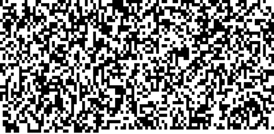

**Figure 14: Pixel grid with the encrypted answers.**

The first function I created was the encryption where it derives a key from the provided password using PBKDF2HMAC (Password-Based Key Derivation Function 2 with Hash-based Message Authentication Code). Then I set up an initialization vector (IV) that enhances the encryption. Finally I set up AES in CFB mode and perform the encryption using the key and IV to write the output into encrypted_answers.txt.

AES is a multi round encryption technique that uses the same key for encryption and decryption [1]. We are using a 14 round approach for 256 bits, i.e the highest encryption level currently available.

Using the encrypted file, I convert the contents into binary (string to binary conversion). Then using the pillow library from python, I perform the conversion of binary numbers to pixels. Each binary number representing a small 20 * 20 box - black depicting 1 and white depicting 0. Initially I printed this into a single line (fig 15) but this would cross the width of the answer sheet and would not be visible to the naked eye, hence I confined it into a grid of 1000 * 1000 pixels (fig 14).

  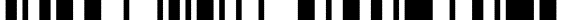

**Figure 15: Aspect fixed image of the single line encryption.**

Issues arose when I tried to decrypt this though. For some reason (probably an error in decryption to text properly due to multiple rounds of encryption in AES), the decryption was providing me with garbage values instead of the answer key. So I thought of switching the encryption technique to XOR (a much simpler approach).

 
 

## 2)	XOR Encryption:
In this methodology, I thought using a simpler hashing function instead of AES would be easier in decryption. The xor_encrypt function takes text with a key and converts them to bytes. It then repeats the key to match the length of the data and performs an XOR operation. The result is then converted back to text. The text is then converted to binary values and then pixels to form a grid similar to what can be seen in fig 14.

This methodology did not work as the code could not encrypt the multiple answers in a single question. So we switched to a completely new approach.

 
 

## 3)	Steganography:
In this approach we encrypt the text from the file in an image. Steganography means hiding something into something else, this could be image in image, text in text, in our case text in images. We use the Stegano library of python that auto encodes the text into a chess board image. It runs row wise and stores the answers in the pixels of the image.

I used the LBS method for this, finding the least significant bits and changing individual pixel values in the RGB scheme of the pixels. For example if Pixel 1 is (0, 0, 0) it will get changed to encrypted_pixel (0, 0, 1). This is when the pixel is white, if the pixel is black then it gets converted from let’s say, Pixel 97: Original=(255, 255, 255) to Encrypted=(254, 254, 254).

  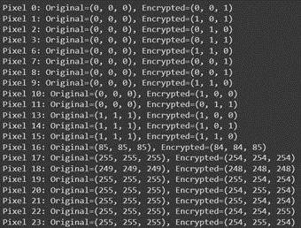

**Figure 16: Comparison of original and encrypted pixels in RGB format.**

In LBS the problem is that it is too specific to a pixel, let’s say the form was shifted by a few pixels, this would not work. Another issue with this approach is that the encryption is invisible to the naked eye, that means just 1 small part of the pixel value has been changed which can only be detected by a computer. Steganography with LBS is a very simple form and can be easily decoded with the right code, hence in industry combining steganography and cryptography is the common practice.

To visualize the difference between the original and the encrypted images, I used the ImageChop library from the pillow package of python. As mentioned earlier, if I try to print the difference, there won’t be anything visible to the naked eye and it appears as a black image (fig 17 left side). To overcome this, the parameter called lambda needs to be multiplied by a factor of 10,000 to amplify the magnitude of encryption so as to make it visible to the naked eye.

  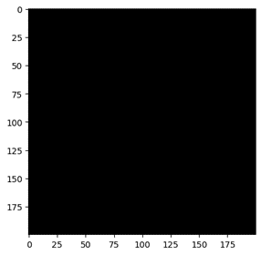
  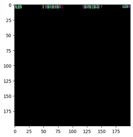

**Figure 17: Difference without amplification (left) and Difference with amplification (right)**

As mentioned earlier, LBS is extremely sensitive to position of the pixels when decoding, this makes the method vulnerable to scan shifts. To make the method invariant, Jaswanth came up with a novel approach based on steganography and changing pixel values row-wise. Paul worked on making the solution invariant by giving us a buffer of around 10-20 pixels in a column. This provides an angular buffer of around 10 degrees from a vertical position that the pixels can likely still be decoded correctly.

The basis of the above approach (a modification on steganography) is to utilize these older approaches we tried prior. The original method was implemented by using the cipher library. Our other novel approach is done by printing a checker board and altering the pixels values within it. This ensures we don't depend on other external libraries and to ensure cross-compatibility with the silo server.

## Cipher Approach:

In this approach the data is encoded in the image using a secret key. The data here is not present on the image but its encoded using a secret key and its extracted by utilizing the same secret key. The below images shows the output of the encoded image.

  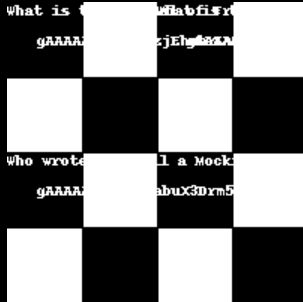

**Figure 18: Cipher encoding result.**

## Finalized approach:

In this approach we tried to encode the values by printing a checker box on the OMR sheet and then encode the answers in the first 85 pixels. This is done by altering the pixels values with very minimal values (various values from 1 to 64). The below image shows the encoded image on the OMR sheet. Minimal changes can be seen with this.

  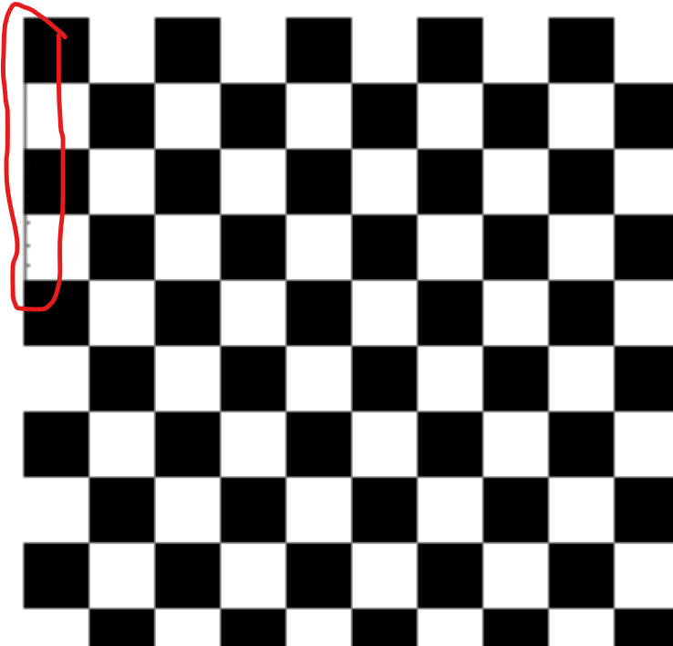

**Figure 19: One pixel offset result.**

But the above approach seems to be susceptible to noise and it may not work ideally on the jpeg images due to their compression technique. We made changes in the technique to make it more noise invariant by increasing the space a single answer is stored in. We used the box size of the checker board to encode answer by altering pixel values of a 1 x 5 area of pixels where each column-wise line encodes an individual answer per black and white space. This means each space can store a total of 4 answers each. Additionally, although this is visible to students, we use a different pixel intensity to encode A, B, C, D, and E to avoid students detecting a linear pattern and making it that much harder to decode during an exam. The exact pixel intensities are essentially shuffled (so A might use a +40 offset and C might use +80, but B could use something like +140). This non-linear variation in addition to the checkerboard should prevent students from decoding it. In addition to all of this, we also use this offset differently on black spaces vs white spaces. For white spaces it is subtracted from 255 and for black spaces it is added directly. This combination of methods resulted in a noise invariant approach. Figure 18 below shows hows the implementation of this approach looks to a student (and how it looks in png vs jpg formats). The extraction is also done with 100% accuracy which can be seen in extract.py code.

Unfortunately, this method isn't quite translation invariant though. We used a checkerboard for this reason though (and given additional time) we would have been able to use the Hough line detection from grade.py to find this square to successfully decode the answers in various shifted locations. Overall, this method performs quite well across sheets, but it is still dependent on knowing the initial location of the square.

  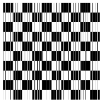
  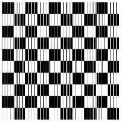

**Figure 20: injected checkerboard png (left) and jpg (right) differences.**

 
 

# References
 - Numpy API Documentation: https://numpy.org/doc/1.26/reference/index.html#reference
 - Pillow API Documentation: https://pillow.readthedocs.io/en/stable/reference/
 - Matplotlib Documentation: https://matplotlib.org/3.5.3/api/_as_gen/matplotlib.pyplot.html
 - tqdm (for loading bars): https://tqdm.github.io/
 - Computer Vision Lectures
 - Discussions with Frangil Koteich on high-level strategies for box detection
 - "A COMBINED CORNER AND EDGE DETECTOR" by Chris Harris and Mike Stephens
 - https://engineering.purdue.edu/kak/compsec/NewLectures/Lecture8.pdf

 
 

# Contributions of the Authors
 - Paul Coen
   - Manual labeling of other image files to have additional ground-truth data
   - Manual labels of the blank_form.jpg boxes included in grade.py
   - Full implementation of grade.py and methods taken within that included
     - Harris corner detection
     - Convolutional FFT function
     - Hough line detection
     - Non-maximal suppression
     - Multiple filtering methods with numpy to transform data in ways that helped produce the end results seen
     - Parameter tuning of the many threshold values within grade.py
   - A full description of the method and implementation on grade.py is included in the grade.py section below
   - Report on grade.py
   - Coding assistance on inject.py and extract.py
 - Jaswanth Kranthi Boppana
   - Suggested the idea of Masking Technique to implement on grade.py
   - Actively involved in discussions and Suggestions of finalizing techniques for grade.py and inject & extract.py.
   - Worked and implemented  various techiques on inject.py , extract.py and finalized one of the method. 
      - Tried to implement cipher encoding.
      - Implemented Answers Encoding using pixel value alteration.(Finalized method)
      - Fine Tunned the pixel alteration method to be versatile enough to work on  both jpeg and png. (Paul's assitance was very helpful).
   - Implementation  process of inject.py and extract.py is clearly mentioned in the above inject & extract text.
 - Mayur Jaisinghani
   - Suggested the use of flood fill in grade.py.
   - Suggested the idea of checking on the left only if there are more than two boxes marked, instead of every single answer.
   - Worked on implementing 3 different methodologies in inject.py.
     - AES encryption
     - XOR encryption
     - Steganography method
   - Full decription of the above methods have been provided in the inject.py section.
   - Maintained minutes of meetings.
